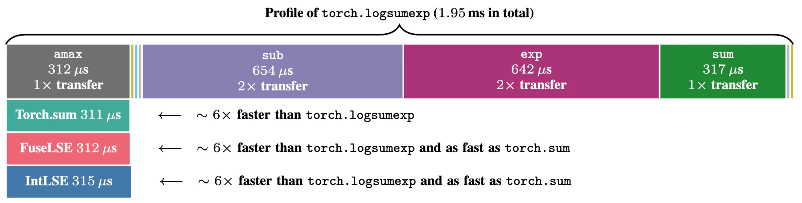

# FuseLSE & IntLSE: Fast Log-Sum-Exp Kernels for GPU and CPU

**Speeding up Log-Sum-Exp: Kernel Fusion at the Memory Wall, Integer Arithmetic at the Compute Wall**  
Lingyun Yao, Martin Andraud, Niki Andreas Loppi, Andrea Pilzer, Anji Liu, Guy Van den Broeck, Martin Trapp  
*NeurIPS 2026 (accepted)*



*One `torch.logsumexp` call at (B, N) = (512, 128256) on a V100 launches nine kernels and moves the
input through HBM ~6 times. FuseLSE and IntLSE use a single kernel and one pass, as fast as `torch.sum`.*

## Main kernels

| | Use on | What it does | Source |
|---|---|---|---|
| **FuseLSE** | GPU | Single-pass fused CUDA kernel with exact float `exp`/`log`; matches `torch.logsumexp` to fp32 rounding, with backward | `fuselse/gpu/` |
| **IntLSE** | CPU | Same single-pass reduction in integer arithmetic (Q16.16 + LUT), AVX2-vectorized; approximate (error ~1e-3–1e-2) | `intlse/cpu/` |

Both are called like `torch.logsumexp` and fall back to it for inputs they don't handle
(other axes, other dtypes, rows of length ≤ 1).

### FuseLSE (GPU)

Requires PyTorch with CUDA and a matching `nvcc`; the kernel compiles on first use.

```python
import sys, torch
from torch.utils.cpp_extension import load

sys.path.insert(0, "fuselse/gpu")
from autograd import make_fuselse_logsumexp

ext = load(name="fuselse", sources=["fuselse/gpu/fused_fp32_kernel.cu"],
           extra_cuda_cflags=["-O3", "--use_fast_math"])
# robust=True handles all -inf/+inf/NaN cases at ~3% extra time
logsumexp = make_fuselse_logsumexp(ext, robust=True)

x = torch.randn(512, 128256, device="cuda", requires_grad=True)
y = logsumexp(x, dim=-1)        # same call as torch.logsumexp
y.sum().backward()

torch.logsumexp = logsumexp     # optional: speed up existing code without editing it
```

### IntLSE (CPU)

Requires `gcc` and an x86-64 CPU with AVX2.

```bash
bash intlse/cpu/build.sh
```

```python
import sys, numpy as np, torch
sys.path.insert(0, "intlse/cpu")
from lse_ctypes_wrapper import logsumexp_intlse   # NumPy / SciPy style
from torch_wrapper import logsumexp_intlse_torch  # PyTorch CPU tensors

logsumexp_intlse(np.random.randn(200, 1000).astype(np.float32), axis=-1)
logsumexp_intlse_torch(torch.randn(200, 1000), dim=-1)
```

## Quick benchmark

Compare with `torch.logsumexp` on your own hardware (run `bash intlse/cpu/build.sh` once first to
include the CPU part; add `--compile` to also time `torch.compile`):

```bash
python benchmark.py
```

Example output on a V100 and a Xeon Gold 6134, for small rows and an LLM-sized vocabulary:

```
GPU: Tesla V100-PCIE-32GB, B=512
       N | torch (ms) | FuseLSE (ms) | speedup | max |diff|
-----------------------------------------------------------
     256 |     0.0830 |       0.0120 |    6.9x |   4.77e-07
  128256 |     1.9437 |       0.3221 |    6.0x |   3.34e-06

CPU: Intel(R) Xeon(R) Gold 6134 CPU @ 3.20GHz, one thread for both methods, B=32
       N | torch (ms) | IntLSE (ms) | speedup | max |diff|
----------------------------------------------------------
     256 |       0.16 |        0.06 |    2.7x |   5.57e-03
  128256 |      69.42 |        7.72 |    9.0x |   1.40e-03
```

The benchmark goes through the Python wrappers, as real applications do. For small rows this
overhead is a large share of each call; calling the CUDA kernel directly gives ~10× (paper, Fig. 3).

## Other variants

Research kernels evaluated in the paper. They take contiguous 2-D `(B, N)` inputs and assume finite values.

| Kernel | Device | Source |
|---|---|---|
| IntLSE (GPU) | GPU | `intlse/gpu/lse_kernel.cu` |
| FuseLSE16 (fp16 input) | GPU | `fuselse/gpu/fused_fp16_kernel.cu` |
| IntLSE-Q10.6 (int16 input) | GPU | `intlse/gpu/lse_kernel_q10_6.cu` |
| FuseLSE (CPU) | CPU | `fuselse/cpu/fused_fp32_cpu.cpp` |
| FuseLSE / IntLSE sparse (probabilistic circuits) | GPU | `experiment_pyjuice/` |

The `experiment_*` folders contain the code for the paper's experiments.

## License

MIT, see [LICENSE](LICENSE).
